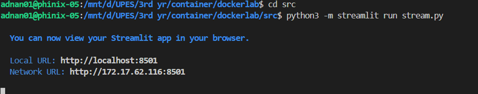
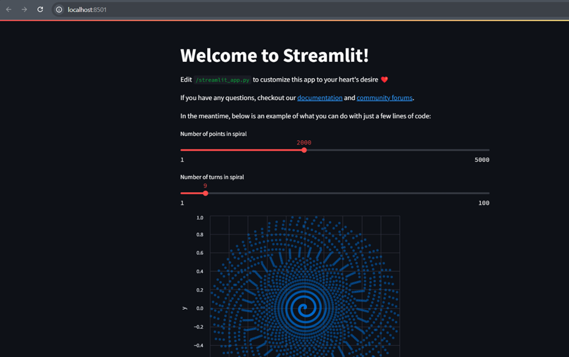
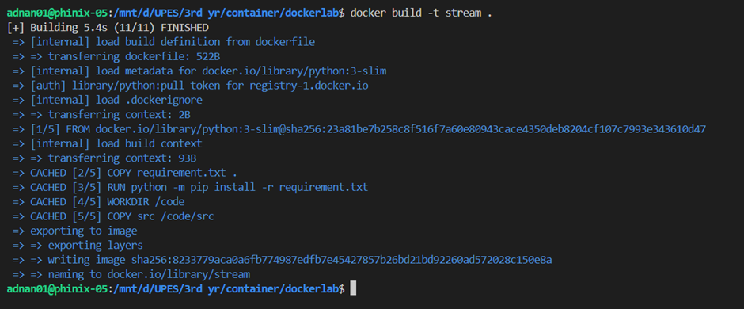

# 🚀 Streamlit + Docker: Interactive Data Visualization

Welcome to **Streamlit Dockerized App**! 🎉 This project demonstrates an **interactive spiral visualization** powered by **Streamlit** and **Altair charts**, fully containerized using **Docker**. Whether you're an absolute beginner or an experienced developer, this guide will help you set up and explore the power of containerized Streamlit applications. 🐳✨

---

## 📌 Overview
This application dynamically generates a **spiral graph** based on user inputs using **Streamlit sliders**. The app is designed to run inside a **Docker container**, ensuring smooth deployment across different environments. It features:

✅ **Interactive Streamlit Web App** for real-time visualization 📊  
✅ **Dockerized Environment** for easy deployment and scalability 🐳  
✅ **Mathematical Computations** to generate a stunning spiral pattern 🔢  

---

## 📂 Project Structure
```bash
📂
│── 📜 docker-compose.yml        # Standard Docker Compose configuration
│── 🛠️ docker-compose.debug.yml  # Debugging-enabled Compose file
│── 📄 Dockerfile                # Docker build instructions
│── 📦 requirement.txt           # Python dependencies
│── 📂 src/
│   │── 🎨 stream.py             # Streamlit app generating a spiral
│── 📖 README.md                 # Project documentation
```

---

## 🔧 Prerequisites
Ensure you have the following installed before proceeding:
- **Docker** → [Install Here](https://www.docker.com/get-started) 🐳  
- **Python 3.x** (if running locally) 🐍  
- **Streamlit & Dependencies** (`requirement.txt` contains all needed libraries)  

---

## 🚀 How to Run the Application
### **1️⃣ Running Locally (Without Docker)**
If you prefer to run the app on your local machine:
```bash
pip install -r requirement.txt
streamlit run src/stream.py
```



Then, open your browser and go to:
```bash
http://localhost:8501
```



### **2️⃣ Running Inside a Docker Container**
To containerize and launch the app:
```bash
docker build -t streamlit-app .
docker run -p 8501:8501 streamlit-app
```



Then, access the app via:
```bash
http://localhost:8501
```


### **3️⃣ Debugging with Docker Compose**
Enable remote debugging by running:
```bash
docker-compose -f docker-compose.debug.yml up --build
```
Then, attach your debugger to **port 5678**.

---

## 📜 Understanding the Code
### **🔹 `src/stream.py` – The Core Application**
- Uses **Altair charts** to visualize a spiral.
- Accepts **user inputs** via sliders.
- Performs **mathematical computations** for the spiral pattern.
- Displays an **interactive graph** inside Streamlit.

### **🔹 `requirement.txt` – Dependencies**
- Lists necessary Python packages: `streamlit`, `altair`, and `pandas`.

### **🔹 `Dockerfile` – Containerization Setup**
- Defines a **lightweight Python environment**.
- Installs required dependencies.
- Copies `stream.py` into the container.
- Runs the Streamlit app inside Docker.

### **🔹 `docker-compose.yml` – Managing Containers**
- Automates **container startup** and service management.

### **🔹 `.vscode/launch.json & tasks.json` – Debugging with VS Code**
- Enables **remote debugging** inside Docker.

---

## 🎨 Customization & Enhancements
Looking to enhance the app? Here are some ideas:
- 🎭 **Change the visualization** → Modify `altair_chart` settings in `stream.py`.
- 📦 **Improve Docker efficiency** → Use **multi-stage builds**.
- 🔐 **Add authentication** → Secure the app using Streamlit secrets.

---

## 💡 Troubleshooting Guide
❓ **Port 8501 already in use?** Run:
```bash
docker ps  # Check running containers
docker stop <container_id>  # Stop the conflicting container
```

❓ **Changes not appearing?** Force-rebuild the container:
```bash
docker-compose up --build --force-recreate
```

---

## 🙌 Contributions & Feedback
Have suggestions or want to contribute? 🚀
✅ Open an issue 📝  
✅ Start a discussion 💬  
✅ Fork & contribute! 🎉  

Let's build powerful containerized apps together! 🐳✨

---

## 🎉 Thank You!
We appreciate your interest in this project! Hope you enjoy working with **Streamlit + Docker**. 🚀 Happy coding! 😃

