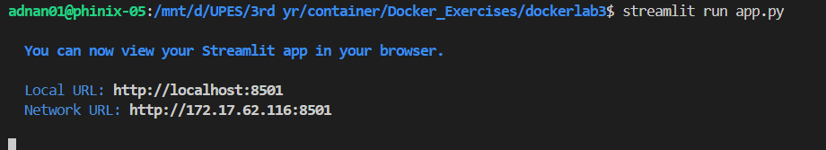
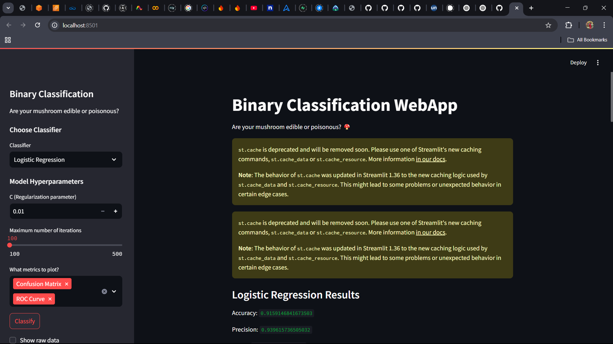
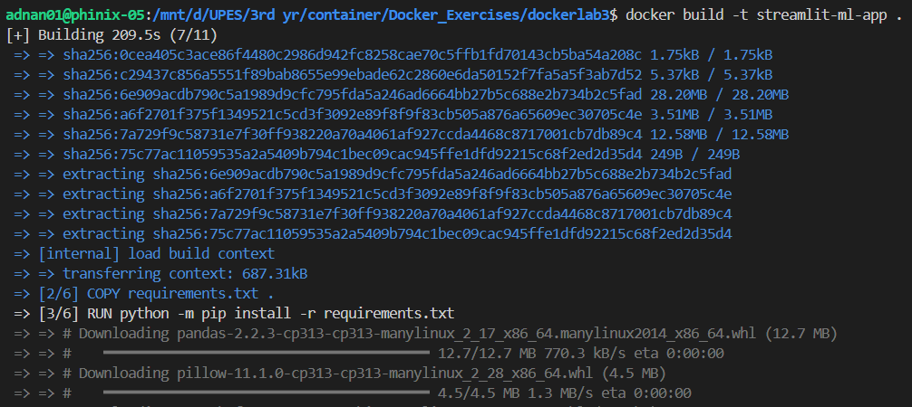
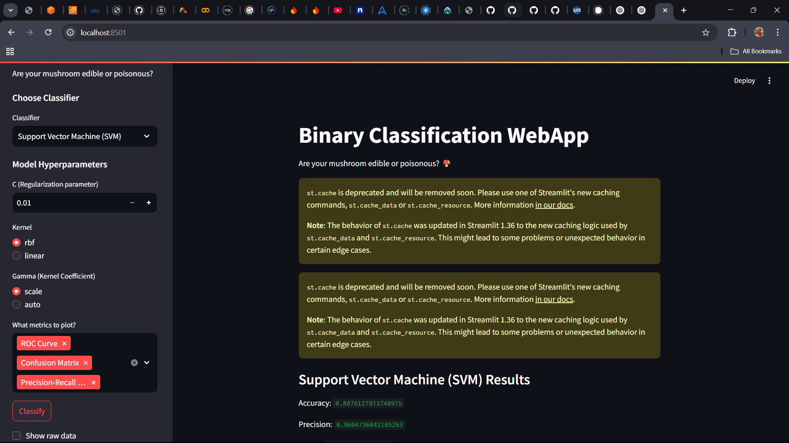

# 🚀 Streamlit + Docker: Machine Learning Classification App

Welcome to **Streamlit Dockerized ML App**! 🎉 This project demonstrates a **machine learning-based binary classification** powered by **Streamlit**, fully containerized using **Docker**. It predicts whether a mushroom is **edible or poisonous** based on input features. Whether you're an ML beginner or an experienced developer, this guide will walk you through setting up and running the application efficiently. 🐳✨

---

## 📌 Overview
This application dynamically classifies mushrooms as **edible or poisonous** using different **machine learning algorithms**. The app is designed to run inside a **Docker container**, ensuring smooth deployment across different environments. It features:

✅ **Interactive Streamlit Web App** for real-time classification 📊  
✅ **Machine Learning Models** (SVM, Logistic Regression, Random Forest) 🤖  
✅ **Dockerized Environment** for easy deployment and scalability 🐳  
✅ **Data Visualization & Performance Metrics** (Confusion Matrix, ROC Curve, Precision-Recall Curve) 📈  

---

## 📂 Project Structure
```bash
📂
│── 📜 docker-compose.yml        # Standard Docker Compose configuration
│── 🛠️ docker-compose.debug.yml  # Debugging-enabled Compose file
│── 📄 Dockerfile                # Docker build instructions
│── 📦 requirements.txt          # Python dependencies
│── 🍄 mushrooms.csv             # Mushroom dataset for classification
│── 📂 src/
│   │── 🎨 app.py                # Streamlit app with ML models
│── 📖 README.md                 # Project documentation
```

---

## 🔧 Prerequisites
Ensure you have the following installed before proceeding:
- **Docker** → [Install Here](https://www.docker.com/get-started) 🐳  
- **Python 3.x** (if running locally) 🐍  
- **Streamlit & Dependencies** (`requirements.txt` contains all needed libraries)  

---

## 🚀 How to Run the Application
### **1️⃣ Running Locally (Without Docker)**
If you prefer to run the app on your local machine:
```bash
pip install -r requirements.txt
streamlit run app.py
```



Then, open your browser and go to:
```bash
http://localhost:8501
```



### **2️⃣ Running Inside a Docker Container**
To containerize and launch the app:
```bash
docker build -t streamlit-ml-app .
docker run -p 8501:8501 streamlit-ml-app
```



Then, access the app via:
```bash
http://localhost:8501
```



### **3️⃣ Debugging with Docker Compose**
Enable remote debugging by running:
```bash
docker-compose -f docker-compose.debug.yml up --build
```
Then, attach your debugger to **port 5678**.

---

## 📜 Understanding the Code
### **🔹 `app.py` – The Core Application**
- Loads and preprocesses the **mushroom dataset**.
- Allows users to select a **classifier** (SVM, Logistic Regression, Random Forest).
- Trains the selected model and evaluates its performance.
- Displays **classification results** and **performance metrics**.
- Generates **visualizations**: Confusion Matrix, ROC Curve, Precision-Recall Curve.

### **🔹 `mushrooms.csv` – The Dataset**
- Contains categorical features representing **mushroom characteristics**.
- The target variable (`type`) indicates **edible (e) or poisonous (p)**.

### **🔹 `requirements.txt` – Dependencies**
- Lists necessary Python packages: `streamlit`, `pandas`, `scikit-learn`, `matplotlib`, `seaborn`.

### **🔹 `Dockerfile` – Containerization Setup**
- Defines a **lightweight Python environment**.
- Installs required dependencies.
- Copies `app.py` and `mushrooms.csv` into the container.
- Runs the Streamlit app inside Docker.

### **🔹 `docker-compose.yml` – Managing Containers**
- Automates **container startup** and service management.

### **🔹 `.dockerignore` – Optimizing Docker Build**
- Excludes unnecessary files from the Docker image.

---

## 🎨 Customization & Enhancements
Looking to enhance the app? Here are some ideas:
- 🏆 **Try more ML models** → Add **Decision Trees, XGBoost, or Neural Networks**.
- 📊 **Enhance visualizations** → Use **Seaborn for better insights**.
- ⚡ **Optimize Docker setup** → Implement **multi-stage builds**.
- 🔐 **Add authentication** → Secure the app using **Streamlit secrets**.

---

## 💡 Troubleshooting Guide
❓ **Port 8501 already in use?** Run:
```bash
docker ps  # Check running containers
docker stop <container_id>  # Stop the conflicting container
```

❓ **Changes not appearing?** Force-rebuild the container:
```bash
docker-compose up --build --force-recreate
```

---

## 🙌 Contributions & Feedback
Have suggestions or want to contribute? 🚀
✅ Open an issue 📝
✅ Start a discussion 💬
✅ Fork & contribute! 🎉

Let's build powerful ML-driven containerized apps together! 🐳✨

---

## 🎉 Thank You!
We appreciate your interest in this project! Hope you enjoy working with **Streamlit, ML, and Docker**. 🚀 Happy coding! 😃

