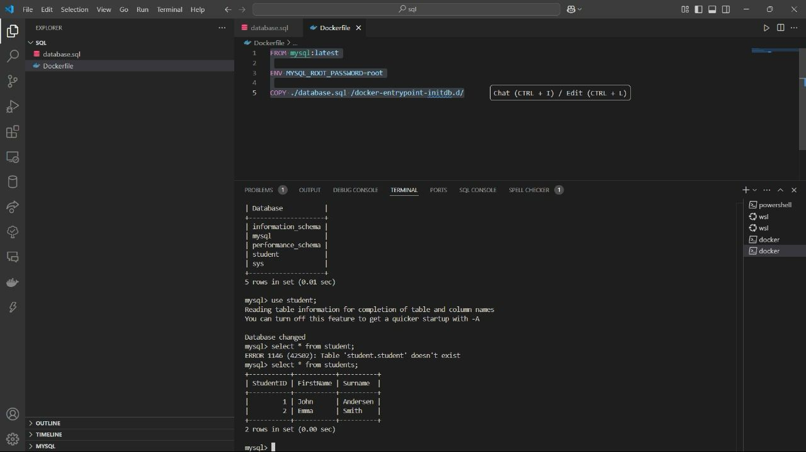

# 🚀 MySQL + Docker: Database Containerization

Welcome to **MySQL Dockerized Database**! 🎉 This project provides a **fully containerized MySQL database** using **Docker**, making it easy to set up, manage, and scale your database environment. Whether you're a developer, DBA, or someone learning Docker, this guide will walk you through everything you need. 🐳✨

---

## 📌 Overview
This project helps you **run a MySQL database inside a Docker container**, with automated initialization using an SQL script. It includes:

✅ **Fully configured MySQL instance** running in a container 🐬  
✅ **Automatic database and table creation** 📦  
✅ **Preloaded sample data** for easy testing 📝  
✅ **Easy access to MySQL database from any MySQL client** 🔗  

---

## 📂 Project Structure
```bash
📂
│── 📜 Dockerfile            # Docker build instructions for MySQL
│── 🗄️ database.sql           # SQL script to create database & table
│── 📖 README.md             # Project documentation
```

---

## 🔧 Prerequisites
Ensure you have the following installed before proceeding:
- **Docker** → [Install Here](https://www.docker.com/get-started) 🐳  
- **MySQL Client** (optional, for external database access)

---

## 🚀 Running the MySQL Database
### **1️⃣ Running MySQL in a Docker Container**
To start the database inside a Docker container:
```bash
docker build -t mysql-db .
docker run --name mysql-container -d -p 3306:3306 mysql-db
```


This will:
- Build a MySQL Docker image named `mysql-db`.
- Start a MySQL container named `mysql-container`.
- Expose MySQL on **port 3306**.

### **2️⃣ Connecting to MySQL Database in Docker**
To access the MySQL database, run:
```bash
docker exec -it mysql-container mysql -u root -p
```
Password: `root`

To view the database and tables:
```sql
SHOW DATABASES;
USE student;
SHOW TABLES;
SELECT * FROM students;
```



### **3️⃣ Stopping and Removing the Container**
To stop the running container:
```bash
docker stop mysql-container
```
To remove the container completely:
```bash
docker rm mysql-container
```

---

## 📜 Understanding the Code
### **🔹 `database.sql` – The MySQL Database Schema**
- **Creates a database** named `student`.
- **Creates a table** named `students` with `StudentID`, `FirstName`, and `Surname`.
- **Inserts sample student data** (`John Andersen`, `Emma Smith`).

### **🔹 `Dockerfile` – MySQL Containerization**
- Uses the **official MySQL image**.
- Sets **root password** to `root`.
- Copies `database.sql` to **initialize the database automatically** inside the container.

---

## 🎨 Customization & Enhancements
Looking to enhance the setup? Here are some ideas:
- 📦 **Modify the database schema** → Extend `database.sql` with new tables.
- 🔒 **Secure the database** → Set up different user roles & passwords.
- 🚀 **Persist data** → Mount a volume for persistent MySQL storage.
- ⚡ **Optimize Dockerfile** → Reduce image size by using a minimal base image.

---

## 💡 Troubleshooting Guide
❓ **MySQL container not starting?** Check logs:
```bash
docker logs mysql-container
```

❓ **Database changes not appearing?** Rebuild the container:
```bash
docker build --no-cache -t mysql-db .
docker run --name mysql-container -d -p 3306:3306 mysql-db
```

---

## 🙌 Contributions & Feedback
Have suggestions or want to contribute? 🚀
✅ Open an issue 📝  
✅ Start a discussion 💬  
✅ Fork & contribute! 🎉  

Let's build a powerful, scalable database system with Docker! 🐳✨

---

## 🎉 Thank You!
We appreciate your interest in this project! Hope you enjoy working with **Docker & MySQL**. 🚀 Happy coding! 😃

