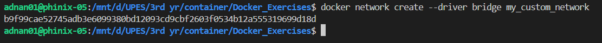
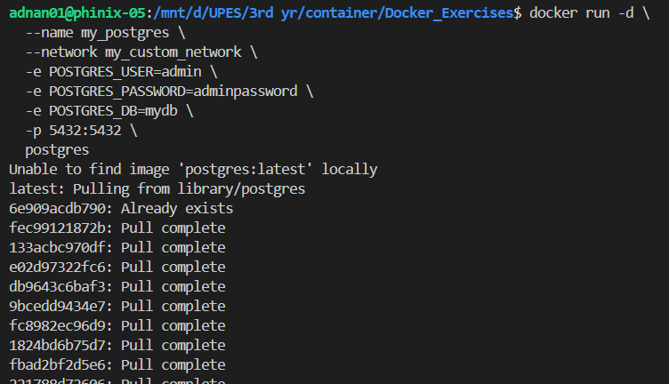

# 🚀 Streamlit + PostgreSQL + Docker: Interactive Data App

Welcome to **Streamlit + PostgreSQL Dockerized App**! 🎉 This project demonstrates a **fully containerized web application** using **Streamlit** for the frontend and **PostgreSQL** as the database. Whether you're building interactive data dashboards or working with databases inside Docker, this guide will walk you through everything you need. 🐳✨

---

## 📌 Overview
This application connects to a **PostgreSQL database**, fetches data from a `users` table, and displays it dynamically on a **Streamlit web app**. The entire project runs inside **Docker containers**, ensuring portability and ease of deployment. It includes:

✅ **Streamlit web interface** for real-time data visualization 📊  
✅ **PostgreSQL database** running inside a Docker container 🐘  
✅ **Dockerized environment** for smooth deployment 🐳  
✅ **Debugging support** via `debugpy` 🛠️  

---

## 📂 Project Structure
```bash
📂
│── 📜 docker-compose.yml        # Standard Docker Compose configuration
│── 🛠️ docker-compose.debug.yml  # Debugging-enabled Compose file
│── 📄 Dockerfile                # Docker build instructions
│── 📦 requirements.txt          # Python dependencies
│── 🎨 stream.py                 # Streamlit app connecting to PostgreSQL
│── 📖 README.md                 # Project documentation
```

---

## 🔧 Prerequisites
Ensure you have the following installed before proceeding:
- **Docker** → [Install Here](https://www.docker.com/get-started) 🐳  
- **Python 3.x** (if running locally) 🐍  
- **PostgreSQL Client** (optional, for connecting to the database outside Docker)

---

## 🚀 Setup Instructions
### **1️⃣ Create a Custom Docker Network**
This ensures communication between the PostgreSQL and Streamlit containers.
```bash
docker network create --driver bridge my_custom_network
```


### **2️⃣ Run PostgreSQL Container**
```bash
docker run -d \
  --name my_postgres \
  --network my_custom_network \
  -e POSTGRES_USER=admin \
  -e POSTGRES_PASSWORD=adminpassword \
  -e POSTGRES_DB=mydb \
  -p 5432:5432 \
  postgres
```


This starts a PostgreSQL container with:
- **Username:** `admin`
- **Password:** `adminpassword`
- **Database:** `mydb`
- **Exposes port 5432** for local access

### **3️⃣ Insert Dummy Data**
#### Connect to PostgreSQL CLI
```bash
docker exec -it my_postgres psql -U admin -d mydb
```
#### Create Table and Insert Data
```sql
CREATE TABLE users (
    id SERIAL PRIMARY KEY,
    name VARCHAR(100),
    email VARCHAR(100) UNIQUE
);

INSERT INTO users (name, email) VALUES
('Alice Johnson', 'alice@example.com'),
('Bob Smith', 'bob@example.com'),
('Charlie Brown', 'charlie@example.com');

SELECT * FROM users;
```


#### Exit PostgreSQL
Type `\q` and press Enter.

### **4️⃣ Build and Run the Streamlit Container**
#### Build the Image
```bash
docker build -t my_streamlit_app .
```
#### Run the Container
```bash
docker run -d \
  --name streamlit_app \
  --network my_custom_network \
  -p 8501:8501 \
  my_streamlit_app
```

### **5️⃣ Test the Setup**
Open a browser and visit:
```bash
http://localhost:8501
```
You should see user data fetched from the PostgreSQL database.

---

## 📜 Understanding the Code
### **🔹 `stream.py` – The Core Application**
- Connects to **PostgreSQL** using `psycopg2`.
- Queries the **users table** and fetches stored data.
- Displays user information inside a **Streamlit web interface**.
- Implements **error handling** for database connectivity issues.

### **🔹 `requirements.txt` – Dependencies**
- Lists required Python libraries: `streamlit`, `psycopg2`.

### **🔹 `Dockerfile` – Containerizing the App**
- Defines a **Python environment** with necessary dependencies.
- Copies `stream.py` into the container.
- Runs the **Streamlit application** inside the container.

### **🔹 `docker-compose.yml` – Managing Containers**
- Automates **database and application startup**.
- Ensures both **Streamlit and PostgreSQL** run in a unified environment.

### **🔹 `.dockerignore` – Optimizing Docker Build**
- Prevents unnecessary files from being added to the Docker image.

---

## 🎨 Customization & Enhancements
Looking to enhance the app? Here are some ideas:
- 🏆 **Expand database schema** → Add more tables or data.
- 📊 **Enhance UI** → Improve Streamlit dashboard design.
- ⚡ **Optimize Docker setup** → Use **multi-stage builds**.
- 🔐 **Add authentication** → Secure database connections.
- 🚀 **Integrate with APIs** → Fetch and store external data.

---

## 💡 Troubleshooting Guide
❓ **Database container fails to start?**
```bash
docker logs my_postgres
```

❓ **Connection issues between Streamlit and PostgreSQL?**
- Ensure both containers are running:
```bash
docker ps
```
- Restart the containers:
```bash
docker restart my_postgres streamlit_app
```

❓ **Changes not appearing in the app?**
```bash
docker-compose up --build --force-recreate
```

❓ **Cannot access the app on `localhost:8501`?**
- Check if the container is running:
```bash
docker ps
```
- Verify no firewall is blocking the port.

---

## ✅ Summary
- **Created a custom Docker network (`my_custom_network`)**
- **Launched a PostgreSQL container and inserted dummy data**
- **Created a Streamlit app that connects to the database**
- **Built and ran the Streamlit container on the same network**
- **Opened `http://localhost:8501` to view the app**

---

## 🗑️ Cleanup
To stop and remove the containers:
```bash
docker stop my_postgres streamlit_app
docker rm my_postgres streamlit_app
docker network rm my_custom_network
```

---

## 🙌 Contributions & Feedback
Have suggestions or want to contribute? 🚀
✅ Open an issue 📝  
✅ Start a discussion 💬  
✅ Fork & contribute! 🎉  

Let's build powerful database-driven apps with Docker! 🐳✨

---

## 🎉 Thank You!
We appreciate your interest in this project! Hope you enjoy working with **Streamlit, PostgreSQL, and Docker**. 🚀 Happy coding! 😃

