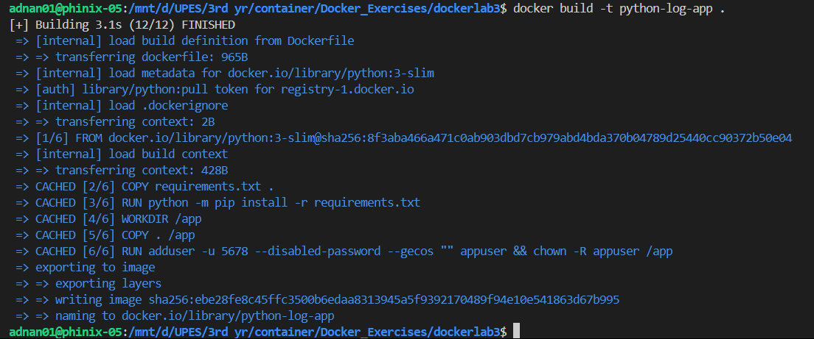
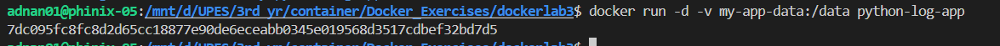
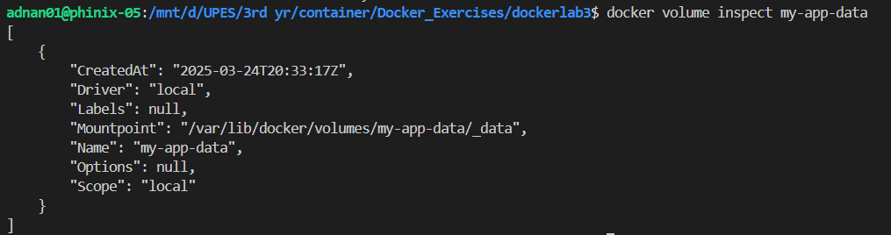

# 🐍 Python Logging Application with Docker

Welcome to the **Python Logging App with Docker**! 🎉 This project demonstrates how to run a **Python logging application inside a Docker container**, ensuring that logs are persisted in a **Docker volume**, even if the container is stopped or removed. 🐳✨

---

## 📌 Overview
This application continuously writes log entries to a file (`app.log`) every 5 seconds. The logs are stored in a **Docker volume**, making them accessible even after the container restarts. This project includes:

✅ **Python-based logging system** 📜  
✅ **Dockerized environment for portability** 🐳  
✅ **Persistent logs using Docker volumes** 💾  
✅ **Lightweight and efficient implementation** ⚡  

---

## 📂 Project Structure
```bash
📂
│── 📜 Dockerfile                # Docker build instructions
│── 📦 app.py                    # Python application generating logs
│── 📖 README.md                 # Project documentation
```

---

## 🔧 Prerequisites
Before starting, ensure you have **Docker** installed on your system:
- [Get Docker Here](https://docs.docker.com/get-docker/) 🐳

---

## 🚀 Steps to Build and Run the Application
### **1️⃣ Writing the Python Application**
Create a file named `app.py` with the following content:
```python
import time

# Create or open a log file to write data
with open("/data/app.log", "a") as log_file:
    while True:
        log_file.write(f"App is running at {time.ctime()}\n")
        log_file.flush()  # Ensure log is written immediately
        time.sleep(5)     # Log entry every 5 seconds
```
This script writes a log entry **every 5 seconds** to `/data/app.log` inside the container.

---

### **2️⃣ Creating a Dockerfile**
Create a `Dockerfile` to containerize the application:
```dockerfile
# Use a lightweight Python image
FROM python:3.9-slim

# Set the working directory inside the container
WORKDIR /app

# Copy the application code into the container
COPY app.py /app/app.py

# Run the Python application
CMD ["python", "app.py"]
```

---

### **3️⃣ Building the Docker Image**
Run the following command to build the Docker image:
```bash
docker build -t python-log-app .
```

This creates an image named `python-log-app`.

---

### **4️⃣ Running the Container with a Volume**
To ensure logs are **persisted**, mount a Docker volume and run the container:
```bash
docker run -d -v my-app-data:/data python-log-app
```

**Explanation:**
- `-d`: Runs the container in detached mode.
- `-v my-app-data:/data`: Mounts the volume `my-app-data` to `/data` inside the container.

---

## 🧐 Verifying Logs
### **Check if the container is running:**
```bash
docker ps
```
### **View logs from the container:**
```bash
docker logs <container-id>
```
Replace `<container-id>` with the ID of your running container.

### **Access the log file inside the container:**
```bash
docker exec -it <container-id> sh
cd /data
cat app.log
```

### **Inspect the volume on the host system:**
```bash
docker volume inspect my-app-data
```

---

## 📜 Understanding the Code
### **🔹 `app.py` – The Core Application**
- Writes log entries every **5 seconds** to `/data/app.log`.
- Uses **Python's built-in file handling** for logging.
- Ensures logs are **immediately written** using `flush()`.

### **🔹 `Dockerfile` – Containerizing the App**
- Uses **Python 3.9-slim** for a **lightweight container**.
- Copies `app.py` into the container.
- Runs the application using `CMD`.

### **🔹 Docker Volume** – Persistent Logs
- **Ensures logs are not lost** when the container stops.
- Can be accessed outside the container using `docker volume inspect my-app-data`.

---

## 🎨 Customization & Enhancements
Want to enhance the setup? Here are some ideas:
- 📊 **Improve logging format** → Add timestamps and log levels.
- 🔄 **Rotate log files** → Implement log rotation to prevent excessive file size.
- 📡 **Send logs to a remote server** → Forward logs to **Elasticsearch, Logstash, or CloudWatch**.
- ⚡ **Optimize Docker setup** → Use **multi-stage builds** for efficiency.

---

## 💡 Troubleshooting Guide
❓ **Container fails to start?**
```bash
docker logs <container-id>
```

❓ **No logs found inside the container?**
```bash
docker exec -it <container-id> sh
cd /data
ls -lah
```

❓ **Changes not appearing in the app?**
```bash
docker-compose up --build --force-recreate
```

❓ **Cannot access the logs on the host system?**
- Ensure the volume exists:
```bash
docker volume ls
```
- Inspect the volume:
```bash
docker volume inspect my-app-data
```

---

## ✅ Summary
- **Created a Python logging app (`app.py`)**.
- **Containerized it using Docker (`Dockerfile`)**.
- **Built and ran the container with persistent logging (`my-app-data` volume)**.
- **Verified logs inside the container and from the host system**.

---

## 🗑️ Cleanup
To stop and remove the containers:
```bash
docker stop <container-id>
docker rm <container-id>
docker volume rm my-app-data
```
To remove the Docker image:
```bash
docker rmi python-log-app
```

---

## 🙌 Contributions & Feedback
Have suggestions or want to contribute? 🚀
✅ Open an issue 📝  
✅ Start a discussion 💬  
✅ Fork & contribute! 🎉  

Let's build reliable logging solutions with Docker! 🐳✨

---

## 🎉 Thank You!
We appreciate your interest in this project! Hope you enjoy working with **Python logging, Docker, and persistent storage**. 🚀 Happy coding! 😃

