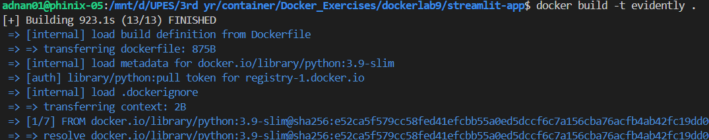
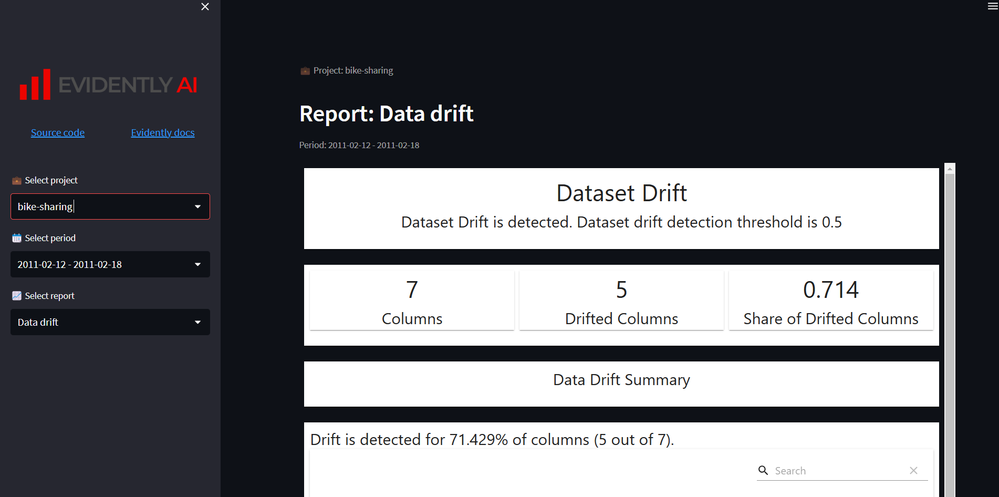

# 🚀 Evidently AI in Docker: A Complete Guide to ML Model Monitoring 🐳📊

Welcome to this comprehensive guide on deploying an Evidently AI-based Streamlit application inside a Docker container. This project enables real-time monitoring of machine learning models, offering interactive reports and insights through a web-based dashboard.

---

## 📌 What You’ll Learn in This Guide?

✅ Setting up an Evidently AI-powered monitoring system for ML models.\
✅ Running the application in a Docker container for easy deployment.\
✅ Organizing ML monitoring projects efficiently.\
✅ Using Streamlit for interactive visualization of model metrics.

---

## 📂 Project Structure

This project is well-organized to maintain clarity and scalability:

```
📂
 ├── streamlit-app/
 │   ├── app.py               # Main Streamlit application file
 │   ├── Dockerfile           # Docker setup for the Streamlit app
 │   ├── requirements.txt     # Python dependencies
 │   ├── src/
 │   │   ├── ui.py            # UI components for the Streamlit app
 │   │   ├── utils.py         # Helper functions for app functionality
 │   ├── static/
 │   │   ├── logo.png         # Project logo
 │   │   ├── preview.png      # Screenshot of the app interface
 │   ├── projects/
 │   │   ├── bike-sharing/    # Bike-sharing analysis project
 │   │   │   ├── bicycle_demand_monitoring.ipynb  # ML notebook
 │   │   │   ├── README.md    # Description of the project
 │   │   │   ├── data/        # Data folder (ignored in Git)
 │   │   │   ├── models/      # Trained models folder (ignored in Git)
 │   │   │   ├── reports/     # Generated reports from the analysis
 │   │   ├── your-project/    # Template for adding new projects
 │   │   │   ├── README.md    # Guide to add a new ML project
 │   │   │   ├── reports/     # Placeholder for new reports

```

---

## 🚀 1️⃣ Setting Up the Application

Before running the application, ensure you have Docker installed on your system.

### 🔹 Step 1: Clone the Repository

```sh
git clone <repo-link>
cd streamlit-app
```

---

## 🐳 2️⃣ Containerizing the Application with Docker

We will package our Streamlit app into a Docker container, ensuring portability across different environments.

### 📝 Dockerfile - Defining the Image

```dockerfile
# Use the official Python base image
FROM python:3.10

# Set the working directory in the container
WORKDIR /app

# Copy the requirements file and install dependencies
COPY requirements.txt /app/
RUN pip install --no-cache-dir --break-system-packages -r requirements.txt

# Copy the entire project into the container
COPY . /app/

# Expose the port Streamlit runs on
EXPOSE 8501

# Run the Streamlit app
CMD ["streamlit", "run", "app.py", "--server.port=8501", "--server.address=0.0.0.0"]
```

---

## 🔧 3️⃣ Installing Dependencies

All required dependencies are listed in `requirements.txt`.

### 📜 requirements.txt

```txt
category_encoders==2.6.0
evidently==0.2.6
jupyter==1.0.0
jupyter_contrib_nbextensions==0.7.0
matplotlib==3.7.0
numpy==1.24.2
pandas==1.5.3
pyarrow==11.0.0
python-box==5.4.1
requests==2.28.2
streamlit==1.19.0
pyyaml==5.1
scikit-learn==1.2.1
scipy==1.10.1
seaborn==0.12.2
altair==4.0
```

📌 **Note:**

- Evidently helps in ML model monitoring.
- Streamlit is used for interactive visualization.

To install these dependencies manually, run:

```sh
pip install -r requirements.txt
```

---

## 🏗 4️⃣ Building & Running the Docker Container

### 🔹 Step 1: Build the Docker Image

```sh
docker build -t evidently .
```


📌 This creates a Docker image named `evidently`.

### 🔹 Step 2: Run the Container

```sh
docker run -p 8501:8501 evidently
```


📌 This runs the Evidently AI dashboard inside a container and maps port `8501`.

### 🔹 Step 3: Access the Dashboard

Open your browser and go to:\
🔗 [http://localhost:8501](http://localhost:8501)

---

## 🌐 5️⃣ Understanding the Streamlit App (`app.py`)

The `app.py` script powers the dashboard, allowing users to navigate different reports.

### **Key Functions:**

- `display_sidebar_header()` → Shows branding & navigation.
- `select_project()` → Lets users choose an ML project.
- `select_period()` → Allows selecting a time period for reports.
- `select_report()` → Fetches available monitoring reports.
- `display_report()` → Loads and displays reports interactively.

📌 The app dynamically lists projects and reports, making monitoring flexible.

---

## 📊 6️⃣ Testing Connectivity in Docker

To verify if the Streamlit app is running correctly inside the container:

### 🔍 Check Running Containers

```sh
docker ps
```

### 🔍 Inspect the Container Logs

```sh
docker logs <container_id>
```

### 🔍 Access the Container Shell

```sh
docker exec -it <container_id> /bin/bash
```

---

## 🚀 7️⃣ Next Steps & Improvements

✅ **Enhancements & Features to Add**

🔹 Authentication: Restrict access to certain projects.\
🔹 Compare Reports: Track model drift over time.\
🔹 Deploy to Cloud: Host on AWS, GCP, or Azure.\
🔹 Database Integration: Store metrics efficiently.

🎯 **This guide helps you set sail with Evidently AI inside Docker. Keep exploring and optimizing! 🚢💡**

---

## 🤝 Contributing to the Project

Want to improve this project? Follow these steps:

1️⃣ Fork the repository & clone it.\
2️⃣ Create a new branch for your feature.\
3️⃣ Make changes and commit them.\
4️⃣ Submit a pull request (PR) for review.

---

## 🎉 Final Thoughts

✅ Evidently AI provides powerful ML monitoring tools.\
✅ Docker ensures seamless deployment and scalability.\
✅ Streamlit offers an intuitive dashboard interface.

💡 Now you're ready to monitor ML models like a pro! 🚀

🎯 **Happy Containerizing! 🐳🎉**

