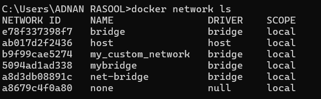
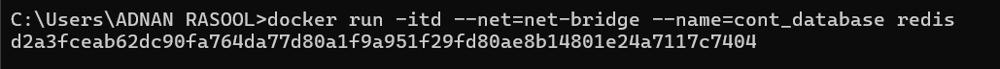
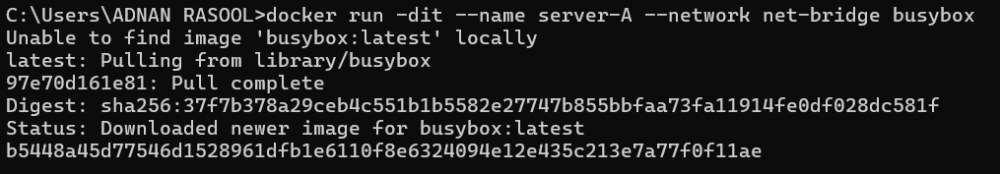
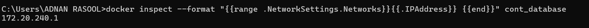
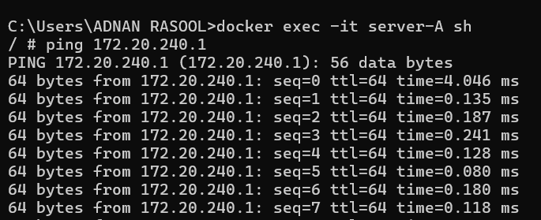
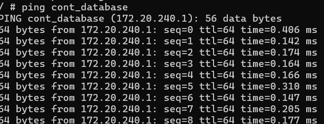

# 🚀 Mastering Docker Bridge Networking: Isolation & Connectivity

## 📌 Project Overview
This repository demonstrates the power of Docker networking by creating a **custom bridge network (net-bridge)** and connecting multiple containers for **seamless inter-container communication**. The experiment explores how containers interact within a **user-defined network** using **ping, DNS name resolution, and direct IP addressing**.

---

## 🎯 **Objectives**
By the end of this experiment, you will:

✅ Understand **Docker bridge networks** and their role in container communication.

✅ Create a **custom Docker network** with defined subnet and IP range.

✅ Deploy **multiple containers** and attach them to the network.

✅ Use **inspection tools** to analyze network settings and connectivity.

✅ Test **container-to-container communication** via IP and hostname.

---

## 🛠 **Setup & Execution**

### 📌 **Prerequisites**
Ensure that you have **Docker installed** and running on your system. You can verify by executing:
```sh
docker --version
```
If Docker is not installed, download and install it from [Docker's official site](https://www.docker.com/).

---

## 🏗 **Step 1: Create a Custom Docker Network**
Docker networks facilitate container communication. We will create a **user-defined bridge network** with a specific **subnet and IP range**:

```sh
docker network create --driver bridge --subnet 172.20.0.0/16 --ip-range 172.20.240.0/20 net-bridge
```

Verify network creation:
```sh
docker network ls
```


✅ *Expected Output:* The list should now include `net-bridge` under the `bridge` driver.

---

## 🏗 **Step 2: Run Containers & Attach to the Network**

### 🛢 **Run a Database Container (Redis)**
```sh
docker run -itd --net=net-bridge --name=cont_database redis
```


🔹 *This runs a Redis container in detached mode and attaches it to `net-bridge`.*

### 🌍 **Run a Server Container (BusyBox)**
```sh
docker run -dit --name server-A --network net-bridge busybox
```


🔹 *This launches a lightweight BusyBox container in interactive mode.*

---

## 🔍 **Step 3: Inspect Network & Containers**

### 🔎 **Check Network Details**
```sh
docker network inspect net-bridge
```
🔹 *This command provides details about the network, connected containers, and assigned IP addresses.*

### 📌 **Retrieve Container Details**
```sh
docker inspect cont_database
```
🔹 *This outputs complete metadata, including network settings.*

### 🌐 **Fetch Container IP Address**
```sh
docker inspect --format "{{range .NetworkSettings.Networks}}{{.IPAddress}} {{end}}" cont_database
```


🔹 *Use the extracted IP address for direct communication testing.*

---

## 🔗 **Step 4: Test Inter-Container Connectivity**

### 🚀 **Access the Shell of Server Container**
```sh
docker exec -it server-A sh
```
🔹 *Now you can execute network tests from inside `server-A`.*

### 📡 **Ping Another Container Using IP Address**
```sh
ping 172.20.240.1  # Replace with actual container IP
```


✅ *If successful, this confirms that containers can communicate via IPs.*

### 📡 **Ping Another Container Using Container Name**
```sh
ping cont_database
```


🔹 *This checks if Docker's built-in DNS resolves container names correctly.*

⚠️ *Note: BusyBox may not always support container name resolution due to its minimal nature.*

---

## 📊 **Observations & Learnings**
✅ Containers within the **same bridge network** can communicate seamlessly.

✅ **IP-based communication** works as expected within the custom network.

✅ **Name resolution** works in most cases, but minimal OS images (like BusyBox) may lack DNS resolution support.

✅ **Docker inspect** is a powerful tool for debugging network configurations.

---

## 🏁 **Conclusion**
This experiment demonstrates Docker’s **networking capabilities**, specifically how **custom bridge networks** facilitate inter-container communication. These concepts are critical for deploying **microservices architectures** and **containerized applications** efficiently.

🚀 **Next Steps:**
- Extend this experiment by adding **more containers** to the network.
- Test connectivity using **other services like Nginx or MySQL**.
- Explore **Docker Compose** to manage multi-container setups.

---

🎯 **Stay tuned for more Docker experiments! 🚀**