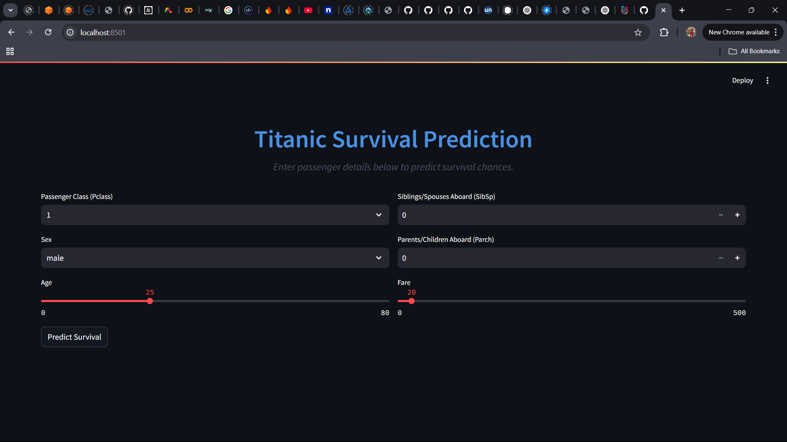

# 🚢 Titanic Survival Predictor: A Containerized Streamlit ML App

## 📌 Overview
The **Titanic Survival Prediction Model** is a machine learning application that predicts whether a passenger would have survived the Titanic disaster based on various input features. 

This project is built using **Python, scikit-learn, pandas, and Streamlit** for a user-friendly web interface. To ensure seamless deployment and portability, **Docker** is used to containerize the application.

---

## 📂 Project Structure
```
Titanic-Prediction/
│── Dockerfile              # Configuration for containerization
│── requirements.txt        # Dependencies required for the application
│── main.py                 # Streamlit web application
│── titanic_model.py        # Model training and preprocessing script
│── titanic_model.pkl       # Serialized machine learning model
```

---

## 🤖 Machine Learning Model (titanic_model.py)
The model is trained using a **Random Forest Classifier** from scikit-learn, based on Titanic dataset features. The trained model is saved as **titanic_model.pkl** using joblib, ensuring efficient storage and easy loading in the web application.

### 🔍 Steps in `titanic_model.py`
1. Load and preprocess the **Titanic dataset**.
2. Handle missing values and **encode categorical data**.
3. Train the **Random Forest Model**.
4. Save the trained model as `titanic_model.pkl` for future predictions.

---

## 🎨 Interactive Streamlit Application (main.py)
The **Streamlit app** provides a clean and interactive interface for users to input passenger details and predict survival chances.

### ✨ Features:
✔️ **User-friendly UI** with enhanced CSS.  
✔️ **Real-time prediction updates** using the trained model.  
✔️ **Interactive sliders, dropdowns, and form elements** for user input.  

---

## 🐳 Docker Setup (Containerization)
To ensure easy deployment across different environments, the application is **containerized using Docker**.

### 📄 Dockerfile
```dockerfile
# Use a minimal Python base image
FROM python:3.12-slim

# Set the working directory
WORKDIR /app

# Copy necessary files
COPY requirements.txt requirements.txt
COPY main.py main.py
COPY titanic_model.pkl titanic_model.pkl

# Install dependencies
RUN pip install --no-cache-dir -r requirements.txt

# Expose the Streamlit application port
EXPOSE 8501

# Run the Streamlit application
CMD ["streamlit", "run", "main.py", "--server.port=8501", "--server.address=0.0.0.0"]
```

---

## 🚀 Running the Application with Docker
Follow these simple steps to **build and run** the containerized application:

### 1️⃣ Navigate to the Project Directory
```bash
cd Titanic-Prediction
```

### 2️⃣ Build the Docker Image
```bash
docker build -t titanic-prediction .
```

### 3️⃣ Run the Docker Container
```bash
docker run -p 8501:8501 titanic-prediction
```


### 4️⃣ Access the Application
Open your browser and navigate to:
```
http://localhost:8501
```

---

## 🌍 Deploying the Application on Cloud
You can deploy the containerized application on cloud platforms like **AWS, GCP, or Azure**.

### 🟢 Deploy to AWS (ECS or EC2)
- Use **AWS Elastic Container Service (ECS)** to deploy the Docker container.
- Alternatively, deploy on **AWS EC2** by setting up an instance and running the container.

### 🔵 Deploy to Google Cloud (GCP - Cloud Run)
- Push the Docker image to **Google Container Registry (GCR)**.
- Deploy the application using **Google Cloud Run** for easy scalability.

### 🔴 Deploy to Azure (Container Instances)
- Use **Azure Container Instances** to host and run the Docker container.
- Alternatively, deploy via **Azure Kubernetes Service (AKS)** for better management.

---

## 🔧 Additional Commands
### 🛑 Stopping the Container
```bash
docker stop <container-id>
```

### 🗑️ Removing a Container
```bash
docker rm <container-id>
```

### ❌ Removing the Docker Image
```bash
docker rmi titanic-prediction
```

---

## 🎯 Conclusion
This project **demonstrates how to deploy a machine learning model** using Streamlit and Docker. The model predicts Titanic survival outcomes based on user input, and the **Dockerized environment** ensures easy portability and deployment.

### 🚀 Next Steps:
✅ **Deploy the containerized app to AWS, GCP, or Azure**.  
✅ **Enhance the UI** with additional Streamlit widgets & visualizations.  
✅ **Improve model accuracy** with better feature engineering.  

⚡ **Happy Coding & Containerizing!** 🐳🚢

