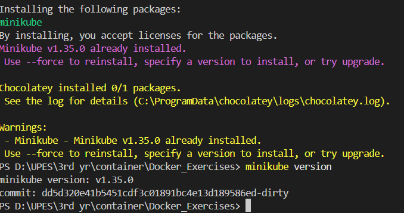
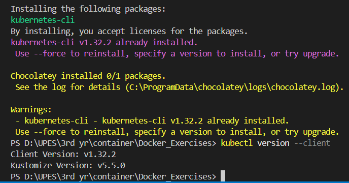

# ☸️ Mastering Minikube & kubectl with Docker on Windows

Welcome to this comprehensive guide on setting up **Minikube and kubectl** with Docker on Windows. This step-by-step guide will help you create a local Kubernetes cluster for testing, development, and learning purposes. 🚀

---

## 📌 What is Minikube?

Minikube is a lightweight Kubernetes implementation that enables you to run a local Kubernetes cluster on your machine. It is perfect for:
✔️ Developers who want to experiment with Kubernetes locally.\
✔️ Testing Kubernetes applications before deploying to production.\
✔️ Running Kubernetes without requiring cloud-based infrastructure.

Minikube runs a Kubernetes cluster inside a virtual machine or a container and supports various drivers like **Docker, VirtualBox, and Hyper-V**.

---

## ☸️ What is Kubernetes?

Kubernetes is an open-source platform that automates the deployment, scaling, and management of containerized applications. It simplifies workload management across multiple servers and ensures high availability. With Kubernetes, you can:
✔️ Deploy applications in containers across multiple nodes.\
✔️ Scale applications automatically based on demand.\
✔️ Manage workloads efficiently with minimal manual effort.\
✔️ Ensure high availability, load balancing, and fault tolerance.

Now, let’s dive into setting up **Minikube and Kubernetes** on Windows! 💻

---

## ✅ Step 1: Install Required Tools

### 1️⃣ Install Docker Desktop 🐋

Minikube can run Kubernetes inside a Docker container, so you need to install **Docker Desktop**:

- [Download Docker Desktop](https://www.docker.com/products/docker-desktop)
- During installation:
  - Ensure **WSL 2 backend** is enabled (recommended). ⚙️
  - If using **Windows Pro/Enterprise**, enable **Hyper-V** (Docker will handle this). 🔧

Verify Docker installation:

```bash
docker --version
```

### 2️⃣ Install Minikube 📦

To install **Minikube**, open **CMD or PowerShell as Administrator** and run:

```bash
choco install minikube
```

👉 If you don’t have **Chocolatey**, install Minikube manually from the [official site](https://minikube.sigs.k8s.io/docs/start/).

Verify Minikube installation:

```bash
minikube version
```


### 3️⃣ Install kubectl

`kubectl` is the command-line tool for interacting with Kubernetes clusters.

```bash
choco install kubernetes-cli
```

Verify installation:

```bash
kubectl version --client
```


---

## ✅ Step 2: Start Minikube with Docker Driver 🐳

Now, start Minikube using **Docker as the driver**. Ensure **Docker Desktop is running**.

1. Start Minikube:

```bash
minikube start --driver=docker
```

👉 This initializes a **Kubernetes cluster** inside a Docker container.

2. Check Minikube status:

```bash
minikube status
```

---

## ✅ Step 3: Deploy an Application 🚀

Let's deploy a **simple Nginx web server** using Kubernetes.

### 1️⃣ Create an Nginx Deployment

```bash
kubectl create deployment nginx --image=nginx
```

### 2️⃣ Expose the Deployment 🔓

Expose the deployment as a **NodePort service**:

```bash
kubectl expose deployment nginx --type=NodePort --port=80
```

### 3️⃣ Get the Service URL 🔗

Retrieve the URL to access the Nginx web server:

```bash
minikube service nginx --url
```

👉 Open the URL in your browser to see the running **Nginx web server**. 🌐

---


## ✅ Step 4: Manage Kubernetes Cluster

### 1️⃣ Check Running Pods 📋

```bash
kubectl get pods
```

### 2️⃣ Scale the Deployment 📏

Scale the Nginx deployment to **3 replicas**:

```bash
kubectl scale deployment nginx --replicas=3
```

Verify:

```bash
kubectl get pods
```

### 3️⃣ Delete the Deployment 🧹

To remove the **Nginx deployment and service**:

```bash
kubectl delete service nginx
kubectl delete deployment nginx
```

---

## ✅ Step 5: Stop and Delete Minikube 🗑️

If you need to stop Minikube or remove all resources:

### 1️⃣ Stop Minikube

```bash
minikube stop
```

### 2️⃣ Delete the Minikube Cluster

```bash
minikube delete
```

This removes all Kubernetes resources created during your session.

---

## 🎯 Conclusion

By using **Minikube with Docker**, you can run Kubernetes locally **without requiring Hyper-V or VirtualBox**. This is a great way to **experiment with Kubernetes** and develop containerized applications efficiently. 🚀

---

## 🔗 Additional Resources

- [Kubernetes Official Documentation](https://kubernetes.io/docs/)
- [Minikube Official Docs](https://minikube.sigs.k8s.io/docs/)
- [Docker Official Documentation](https://docs.docker.com/)

💡 **Now you're ready to build and manage Kubernetes applications locally!** 🎉

