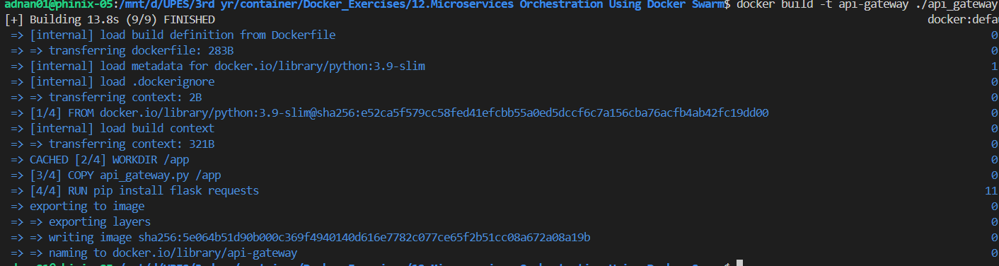
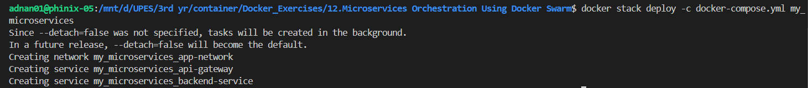
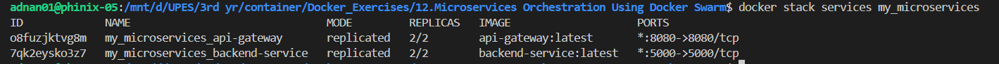

# 🚀 Microservices Orchestration Using Docker Swarm

## 📌 Overview
This project demonstrates **Microservices Orchestration** using **Docker Swarm**, Docker's native clustering and orchestration tool. We will create a simple microservices architecture with two services:

1. **API Gateway** - Acts as the entry point for users.
2. **Backend Service** - Provides data to the API Gateway.

Using **Docker Swarm**, we will deploy, manage, scale, and update these services efficiently.

---

## 🛠 Prerequisites
Ensure you have the following installed:
- **Docker** (latest version)
- **Docker Swarm** initialized (`docker swarm init`)
- **Python** (for microservices development)

---

## 📂 Project Structure
```
📂Microservices-Docker-Swarm/
│── backend/
│   ├── backend.py        # Backend service code
│   ├── Dockerfile        # Dockerfile for Backend
│── api_gateway/
│   ├── api_gateway.py    # API Gateway code
│   ├── Dockerfile        # Dockerfile for API Gateway
│── docker-compose.yml    # Swarm stack definition
```

---

## 🖥️ Microservices Development

### 1️⃣ Backend Service
#### 📜 `backend.py`
```python
from flask import Flask

app = Flask(__name__)

@app.route('/')
def hello():
    return "Hello from the Backend Service!"

if __name__ == "__main__":
    app.run(host='0.0.0.0', port=5000)
```
#### 📜 Dockerfile (Backend)
```dockerfile
FROM python:3.9-slim
WORKDIR /app
COPY backend.py /app
RUN pip install flask
CMD ["python", "backend.py"]
```

---

### 2️⃣ API Gateway
#### 📜 `api_gateway.py`
```python
from flask import Flask
import requests

app = Flask(__name__)

@app.route('/')
def hello():
    backend_response = requests.get('http://backend-service:5000')
    return f"API Gateway: {backend_response.text}"

if __name__ == "__main__":
    app.run(host='0.0.0.0', port=8080)
```
#### 📜 Dockerfile (API Gateway)
```dockerfile
FROM python:3.9-slim
WORKDIR /app
COPY api_gateway.py /app
RUN pip install flask requests
CMD ["python", "api_gateway.py"]
```

---

## 🐳 Building Docker Images
Navigate to the project directory and build the images:
```bash
# Build the backend service
docker build -t backend-service ./backend


# Build the API Gateway
docker build -t api-gateway ./api_gateway
```


---

## 🏗️ Deploying with Docker Swarm

### 1️⃣ Initialize Docker Swarm
```bash
docker swarm init
```
This will initialize your machine as a Swarm Manager.

### 2️⃣ Create the Docker Swarm Stack
#### 📜 `docker-compose.yml`
```yaml
version: '3.7'
services:
  backend-service:
    image: backend-service
    deploy:
      replicas: 2
      restart_policy:
        condition: on-failure
    networks:
      - app-network
    ports:
      - "5000:5000"

  api-gateway:
    image: api-gateway
    deploy:
      replicas: 2
      restart_policy:
        condition: on-failure
    networks:
      - app-network
    ports:
      - "8080:8080"
    depends_on:
      - backend-service

networks:
  app-network:
    driver: overlay
```
### 3️⃣ Deploy the Stack
```bash
docker stack deploy -c docker-compose.yml my_microservices
```


This will create and deploy the services in the Swarm.

### 4️⃣ Verify Running Services
```bash
docker stack services my_microservices
```


---

## 🌐 Accessing the Application
- **API Gateway**: [http://localhost:8080](http://localhost:8080)
- The API Gateway fetches responses from the Backend Service dynamically.


To check logs for troubleshooting:
```bash
docker service logs my_microservices_api-gateway
```

---

## 📈 Scaling Services
Easily scale up or down with:
```bash
docker service scale my_microservices_backend-service=5
```
This increases the backend service replicas to **5**.

---

## 🔄 Updating Services
If you update the backend service code, rebuild and deploy the new image:
```bash
docker service update --image backend-service:latest my_microservices_backend-service
```
This updates the backend service while keeping the system running.

---

## ❌ Removing the Stack
Once testing is complete, remove the stack:
```bash
docker stack rm my_microservices
```
This stops and removes all services in the stack.

---

## 🎯 Summary
✔ Created **API Gateway** and **Backend Service** microservices.  
✔ Dockerized both services.  
✔ Defined **Docker Compose for Swarm** to manage and deploy services.  
✔ Deployed using **Docker Swarm** for scalability and fault tolerance.  
✔ Accessed services and demonstrated **scaling & updates**.  

---

## 🚀 Next Steps
✅ **Deploy the stack on AWS/GCP using managed Swarm clusters**.  
✅ **Integrate a database like MySQL or MongoDB for persistent storage**.  
✅ **Enhance API Gateway with authentication & rate-limiting**.  

⚡ **Happy Coding & Orchestrating!** 🐳🎯

