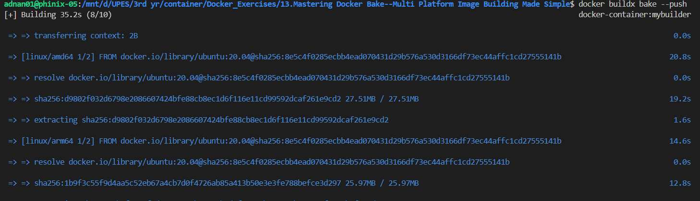
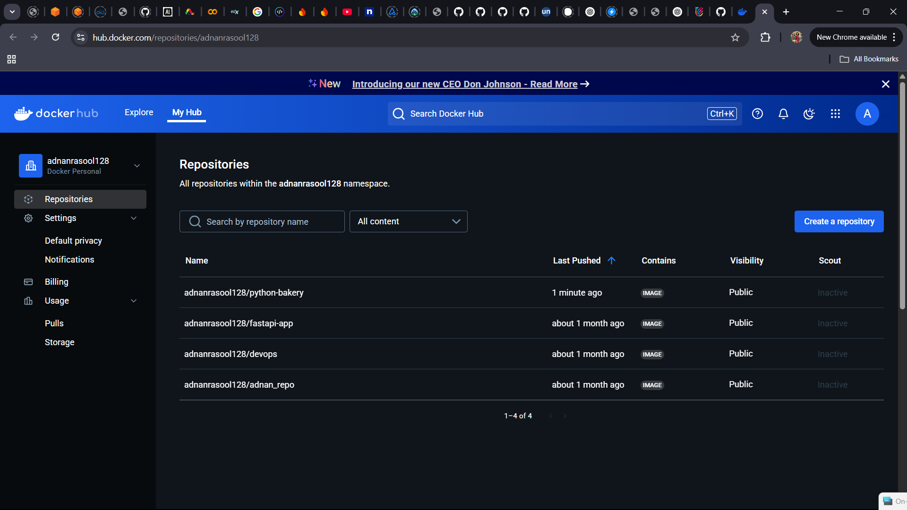
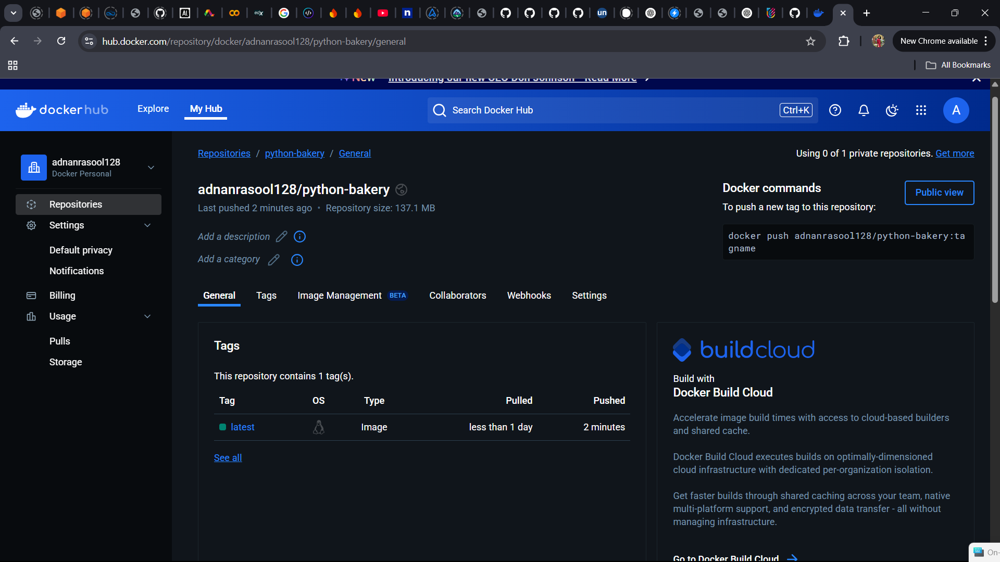

# 🏗️ Mastering Docker Bake: Multi-Platform Image Building Made Simple

## 📌 Overview
Docker Bake is a powerful tool that simplifies the process of building and managing **multi-platform Docker images** using `docker buildx bake`. It enables **parallel builds, cross-platform compatibility, and efficient image pushing**, making it a must-have for modern containerized applications.

This guide demonstrates how to use Docker Bake to create **multi-architecture images** for Python 3.9 and push them to **Docker Hub**.

---

## 🚀 Key Features
✅ **Parallel Builds** – Build multiple images simultaneously, reducing build time.  
✅ **Multi-Platform Support** – Supports architectures like `x86_64 (AMD64)` and `ARM64`.  
✅ **Centralized Configuration** – Manage builds using an HCL, JSON, or YAML configuration file.  
✅ **Declarative Approach** – Define build targets in a structured, maintainable format.  
✅ **Efficient Pushing** – Push images to Docker Hub with a single command.  

---

## 🛠 Prerequisites
Ensure you have the following installed on your system:

- **Docker** (version 20.10+)
- **Docker Buildx** (for multi-platform builds)
- **A Docker Hub account** (for image hosting)

### 🔍 Verify Installation:
Run the following commands to check if everything is installed correctly:

```bash
docker --version   # Check Docker version
docker buildx version   # Check Buildx version
```

---

## 📂 Project Structure
```
📂
├── Dockerfile          # Base Dockerfile for Python 3.9
├── docker-bake.hcl     # Docker Bake configuration file
└── README.md           # Documentation
```

---

## 🧑‍💻 Step 1: Create Dockerfile
This `Dockerfile` installs **Python 3.9** inside a minimal Ubuntu 20.04 image:

```dockerfile
# Dockerfile
FROM ubuntu:20.04

RUN apt-get update && apt-get install -y \
    python3.9 python3.9-venv python3.9-dev \
    && rm -rf /var/lib/apt/lists/*

CMD ["python3"]
```

---

## 🏗 Step 2: Define Build Configuration (docker-bake.hcl)
Docker Bake uses an **HCL configuration file** to define multiple build targets.

```hcl
# docker-bake.hcl

group "default" {
    targets = ["python-bakery"]
}

target "python-bakery" {
    context    = "."
    dockerfile = "Dockerfile"
    platforms  = ["linux/amd64", "linux/arm64"]
    tags       = ["yourusername/python-bakery:latest"]
}
```

🔹 **`targets`** – Defines a build target (`python-bakery`).  
🔹 **`context`** – Specifies the build context (`.` means current directory).  
🔹 **`dockerfile`** – Points to the `Dockerfile`.  
🔹 **`platforms`** – Defines architectures to build (`amd64` & `arm64`).  
🔹 **`tags`** – Sets the Docker image tag (replace `yourusername` with your actual Docker Hub username).  

---

## 🚀 Step 3: Build and Push Images

### 1️⃣ **Login to Docker Hub**
```bash
docker login
```

### 2️⃣ **Build and Push Images Using Docker Bake**
```bash
docker buildx bake --push
```


✅ This command will build Python 3.9 images for **both AMD64 and ARM64** and push them to Docker Hub.

---

## 📦 Step 4: Verify Image on Docker Hub
Once the images are pushed, visit your Docker Hub repository:

🔗 **[Docker Hub Repository](https://hub.docker.com/repository/docker/yourusername/python-bakery/general)**

(Replace `yourusername` with your actual Docker Hub username.)





---

## 📌 Additional Commands

### 🛑 Stop a Running Container
```bash
docker stop <container-id>
```

### 🗑️ Remove a Container
```bash
docker rm <container-id>
```

### ❌ Remove an Image
```bash
docker rmi yourusername/python-bakery:latest
```

### 🖥️ List All Buildx Builders
```bash
docker buildx ls
```

### 🔄 Create a New Buildx Builder
```bash
docker buildx create --name mybuilder --use
```

### 🏗️ Inspect the Buildx Builder
```bash
docker buildx inspect --bootstrap
```

---

## 🚀 Conclusion
Docker Bake simplifies **multi-platform Docker builds** by allowing parallel execution and centralized configuration. With just a few commands, you can build images for multiple architectures and push them efficiently.

### 💡 Next Steps:
✅ **Experiment with adding more build targets**.  
✅ **Explore build caching for faster builds**.  
✅ **Integrate Docker Bake into your CI/CD pipelines**.  

🎉 **Happy Building with Docker Bake!** 🐳🔥

