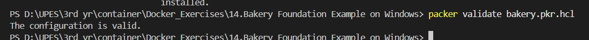
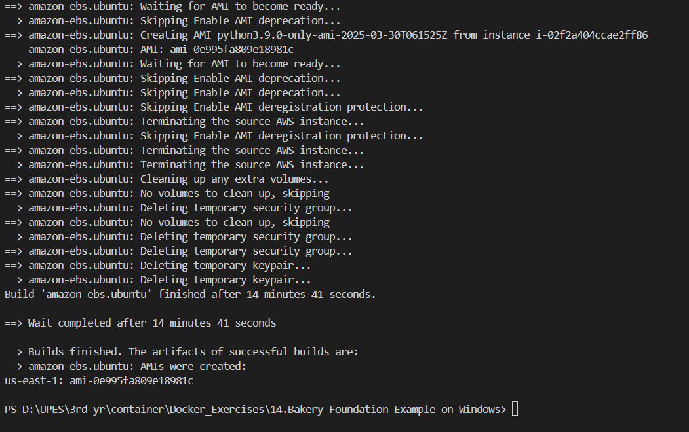
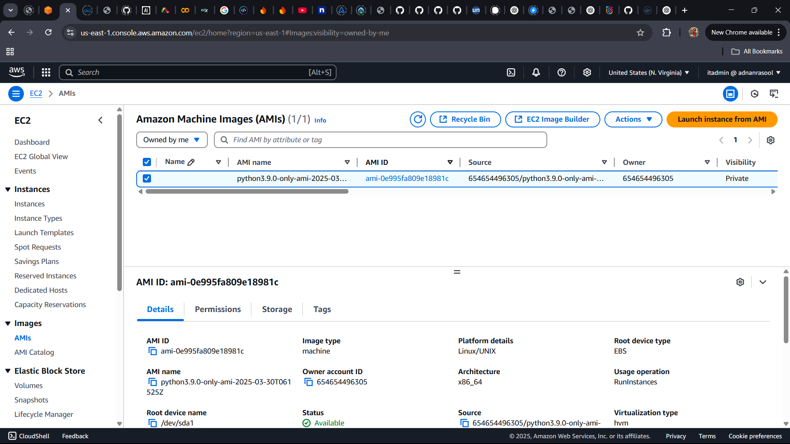
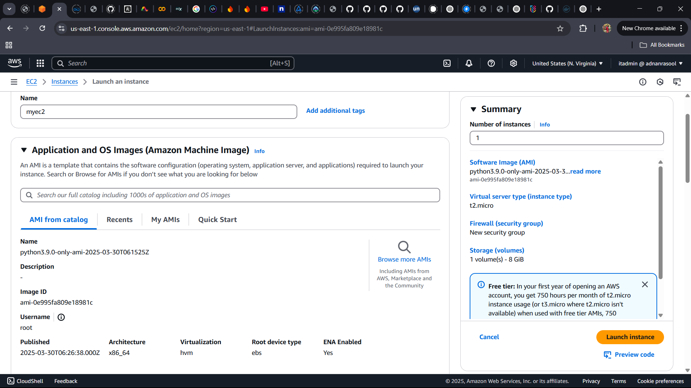
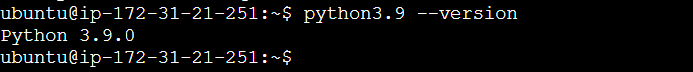

# 🍞 Bakery Foundation Example on Windows

## 📌 Overview

This guide provides a comprehensive, step-by-step walkthrough for setting up and using **Packer** to create an **Amazon Machine Image (AMI)** on **AWS**. It covers installation, configuration, image creation, and deployment on a Windows machine.

## 🛠 Prerequisites
Before you begin, ensure you have:

- A **Windows machine** with administrator access.
- An **AWS account** with IAM credentials.
- Basic knowledge of **AWS** and **PowerShell**.

---

## 🚀 Step 1: Install Required Tools

### 🔹 1.1 Install Packer

#### **Step 1: Download Packer**
1. Open your browser and visit the **[Packer Download Page](https://www.packer.io/downloads)**.
2. Download the latest **Windows (64-bit) ZIP file**.

#### **Step 2: Extract Packer**
1. Navigate to the downloaded ZIP file.
2. Right-click and select **Extract All...**.
3. Move `packer.exe` to `C:\packer` (Create this folder if it doesn’t exist).

#### **Step 3: Add Packer to System PATH**
1. Open **Environment Variables** (Search for it in Windows).
2. Click **Environment Variables** → Under **System Variables**, find `Path` → Click **Edit**.
3. Click **New**, then add:
   ```
   C:\packer
   ```
4. Click **OK** and close all windows.

#### **Step 4: Verify Packer Installation**
Open PowerShell and run:
```powershell
packer --version
```
✅ If successful, the **Packer version** will be displayed.

---

### 🔹 1.2 Install AWS CLI

#### **Step 1: Download AWS CLI**
1. Go to the **[AWS CLI Download Page](https://aws.amazon.com/cli/)**.
2. Download and run the `AWSCLI.msi` installer.

#### **Step 2: Install AWS CLI**
1. Follow the on-screen steps: **Next → Next → Finish**.
2. Verify installation:
   ```powershell
   aws --version
   ```
✅ If successful, it should display something like:
```
aws-cli/2.x.x Windows/10
```

---

### 🔹 1.3 Configure AWS CLI (5 minutes)

Run the following command in PowerShell:
```powershell
aws configure
```
Enter the following when prompted:
- **AWS Access Key ID**: `<Your AWS Key>`
- **AWS Secret Access Key**: `<Your AWS Secret>`
- **Default region name**: `us-east-1` (or your preferred region)
- **Default output format**: `json` (Press Enter)

✅ AWS CLI is now configured.

---

## 🏗 Step 2: Create the Packer Template

### 🔹 2.1 Create the Packer HCL File

1. Open **Notepad** or **VS Code**.
2. Copy the following code into a new file:

```hcl
packer {
  required_plugins {
    amazon = {
      source  = "github.com/hashicorp/amazon"
      version = ">= 1.0.0"
    }
  }
}

variable "aws_region" {
  default = "us-east-1"
}

source "amazon-ebs" "ubuntu" {
  region           = var.aws_region
  source_ami      = "ami-04b4f1a9cf54c11d0" # Ubuntu 20.04 AMI (ensure this exists)
  instance_type   = "t2.micro"
  ssh_username    = "ubuntu"
  "ami_name": "python3.9-only-ami-{{timestamp}}",
}

build {
  sources = ["source.amazon-ebs.ubuntu"]

  provisioner "shell" {
  inline = [
    "curl https://pyenv.run | bash",
    "export PATH=$HOME/.pyenv/bin:$PATH",
    "eval \"$(pyenv init --path)\"",
    "pyenv install 3.9.0",
    "pyenv global 3.9.0",
    "python3.9 --version"
  ]
}

}


```

3. Save the file as **`bakery.pkr.hcl`** in `C:\packer`.

---

### 🔹 2.2 Find a Valid Ubuntu AMI

Run the following AWS CLI command to get the latest Ubuntu AMI:
```powershell
aws ec2 describe-images --owners 099720109477 --filters "Name=name,Values=ubuntu/images/hvm-ssd/ubuntu-focal-20.04-amd64-server-*" --query "Images | sort_by(@, &CreationDate)[-1].ImageId" --output text
```
✅ Update **`source_ami`** in `bakery.pkr.hcl` with the retrieved AMI ID.

---

## 🛠 Step 3: Validate and Build the Image

### 🔹 3.1 Initialize and Validate Packer Template

1. Open PowerShell and navigate to `C:\packer`:
```powershell
cd C:\packer
```
2. Initialize Packer:
```powershell
packer init .
```
3. Validate the template:
```powershell
packer validate bakery.pkr.hcl
```
✅ Expected Output: The configuration is valid.


---

### 🔹 3.2 Build the Machine Image

Run the following command:
```powershell
packer build bakery.pkr.hcl
```


This will:
- Create a **temporary EC2 instance**.
- Install **Python 3.9**.
- Convert it into an **Amazon Machine Image (AMI)**.
- Delete the temporary instance.

---

## ☁️ Step 4: Deploy and Test the AMI

### 🔹 4.1 Find the AMI
1. Log in to **AWS Console**.
2. Navigate to **EC2 → AMIs**.
3. Find the AMI named: `python3.9-only-ami-{{timestamp}}`.



### 🔹 4.2 Launch an EC2 Instance with Your AMI

1. Go to **AWS EC2 Console**.
2. Click **Launch Instance** → **My AMIs**.
3. Search for your AMI and **Select It**.
4. Configure the instance:
   - **Instance Type**: `t2.micro`
   - **Security Group**: Allow **SSH (port 22)**.
5. Click **Launch**! 🚀



### 🔹 4.3 Verify Python Installation

Once inside the instance, run:
```bash
python3.9 --version
```
✅ Expected Output:
```
Python 3.9.0

```


---

## 🎯 Conclusion

You have successfully:
✅ Installed **Packer** and **AWS CLI**.
✅ Created and validated a **Packer template**.
✅ Built an **AMI** and deployed it on **AWS EC2**.

🚀 **Next Steps**:
- **Optimize Your AMI**: Add more provisioning steps.
- **Automate with CI/CD**: Integrate Packer with CI/CD pipelines.
- **Monitor Costs**: Keep an eye on AWS billing.

📚 **Further Reading**:
- [Packer Documentation](https://www.packer.io/docs)
- [AWS EC2 User Guide](https://docs.aws.amazon.com/AWSEC2/latest/UserGuide/concepts.html)

Happy Baking with Packer! 🍞✨

